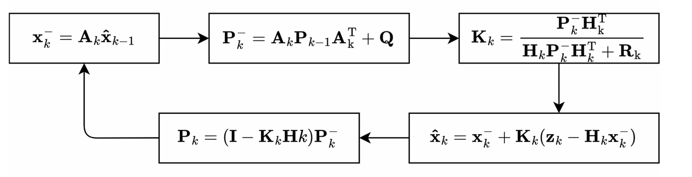

# 里程计

为了使机器人能够实现定点、自由移动的功能，需要为机器人设计里程计，反馈机器人当前的速度和位移。

简单的轮式里程计，即用轮速反馈进行积分、对轮速进行控制的方式，容易出现位移积分发散、轮子打滑位移无法计算的问题，因此需要考虑引入IMU数据进行融合。

对于预测与估计任务，我们可以使用卡尔曼滤波器。

我们期望估计

```math
\boldsymbol{x}(t) = \begin{bmatrix} x_b(t) \\ \dot{x}_b(t) \\ \ddot{x}_b(t) \end{bmatrix}
```

考虑带噪声的连续系统的状态空间方程

```math
\dot{\boldsymbol{x}}(t) = \boldsymbol{A}_c \boldsymbol{x}(t) + \boldsymbol{G}_c w(t)
```

状态转移矩阵 
```math
\boldsymbol{A}_c = \begin{bmatrix} 0 & 1 & 0 \\ 0 & 0 & 1 \\ 0 & 0 & 0 \end{bmatrix}
```
噪声驱动矩阵
```math
\boldsymbol{G}_c = \begin{bmatrix} 0 \\ 0 \\ 1 \end{bmatrix}
```

但实际上我们是对系统进行周期为 $`T_0`$ 的离散控制，状态方程为
```math
\begin{cases}
\boldsymbol{x}(k+1) = \boldsymbol{A} \boldsymbol{x}(k) + \boldsymbol{w}(k) \\
\boldsymbol{z}(k)=\boldsymbol{H}x(k)+\boldsymbol{v}(k)
\end{cases}
```
其中离散化之后

状态转移矩阵

```math
\boldsymbol{A} = \begin{bmatrix} 1 & T_0 & \frac{1}{2}T_0^2 \\ 0 & 1 & T_0 \\ 0 & 0 & 1 \end{bmatrix}
```
观测矩阵，我们通过轮速反馈得到速度观测，通过IMU得到加速度观测
```math
\boldsymbol{H} = \begin{bmatrix} 0 & 1 & 0 \\ 0 & 0 & 1 \end{bmatrix}
```

希望通过卡尔曼滤波器进行计算，我们还需要过程噪声协方差矩阵、观测噪声协方差矩阵以及初始误差协方差矩阵。

根据线性系统理论，连续系统的过程噪声协方差矩阵离散化到周期 $`T_0`$ 时的标准计算公式为：

```math
\boldsymbol{Q} = \int_{0}^{T_0} \boldsymbol{\Phi}(\tau) \boldsymbol{G}_c \sigma^2 \boldsymbol{G}_c^T \boldsymbol{\Phi}^T(\tau) d\tau
```

其中，连续状态转移矩阵 $\boldsymbol{\Phi}(\tau)$ 为 $e^{\boldsymbol{A}_c \tau}$，展开后为：


```math
\boldsymbol{\Phi}(\tau) = \begin{bmatrix} 1 & \tau & \frac{1}{2}\tau^2 \\ 0 & 1 & \tau \\ 0 & 0 & 1 \end{bmatrix}
```

```math
\boldsymbol{\Phi}(\tau) \boldsymbol{G}_c = \begin{bmatrix} 1 & \tau & \frac{1}{2}\tau^2 \\ 0 & 1 & \tau \\ 0 & 0 & 1 \end{bmatrix} \begin{bmatrix} 0 \\ 0 \\ 1 \end{bmatrix} = \begin{bmatrix} \frac{1}{2}\tau^2 \\ \tau \\ 1 \end{bmatrix}
```

```math
(\boldsymbol{\Phi}(\tau) \boldsymbol{G}_c) (\boldsymbol{\Phi}(\tau) \boldsymbol{G}_c)^T = \begin{bmatrix} \frac{1}{2}\tau^2 \\ \tau \\ 1 \end{bmatrix} \begin{bmatrix} \frac{1}{2}\tau^2 & \tau & 1 \end{bmatrix} = \begin{bmatrix} \frac{1}{4}\tau^4 & \frac{1}{2}\tau^3 & \frac{1}{2}\tau^2 \\ \frac{1}{2}\tau^3 & \tau^2 & \tau \\ \frac{1}{2}\tau^2 & \tau & 1 \end{bmatrix}
```

```math
\boldsymbol{Q} = \sigma^2
\begin{bmatrix} 
\int_{0}^{T_0} \frac{1}{4}\tau^4 d\tau & \int_{0}^{T_0} \frac{1}{2}\tau^3 d\tau & \int_{0}^{T_0} \frac{1}{2}\tau^2 d\tau \\ 
\int_{0}^{T_0} \frac{1}{2}\tau^3 d\tau & \int_{0}^{T_0} \tau^2 d\tau & \int_{0}^{T_0} \tau d\tau \\ 
\int_{0}^{T_0} \frac{1}{2}\tau^2 d\tau & \int_{0}^{T_0} \tau d\tau & \int_{0}^{T_0} 1 d\tau 
\end{bmatrix}= \sigma^2
\begin{bmatrix}
\frac{T_0^5}{20} & \frac{T_0^4}{8} & \frac{T_0^3}{6}\\
\frac{T_0^4}{8} & \frac{T_0^3}{3} & \frac{T_0^2}{2}\\
\frac{T_0^3}{6} & \frac{T_0^2}{2} & T_0
\end{bmatrix}
```

过程观测噪声协方差，理论上可以通过测量传感器方差获得
```math
\boldsymbol{R} = \begin{bmatrix} \sigma_{\text{vec}}^2 & 0 \\ 0 & \sigma_{\text{acc}}^2 \end{bmatrix} 
```
为了提升抗打滑性能，可以通过动态调节该矩阵减小打滑的影响 @TODO

初始误差协方差，可以调节为一个非0的初始误差估计值，不需要非常准确
```math
\boldsymbol{P}_0 = \begin{bmatrix} 10 & 0 & 0 \\ 0 & 10 & 0 \\ 0 & 0 & 10 \end{bmatrix}
```


使用卡尔曼五步迭代

